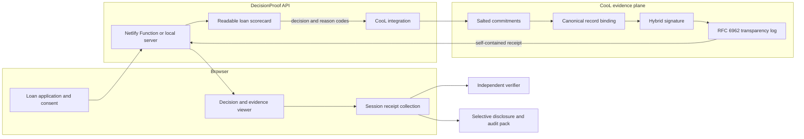
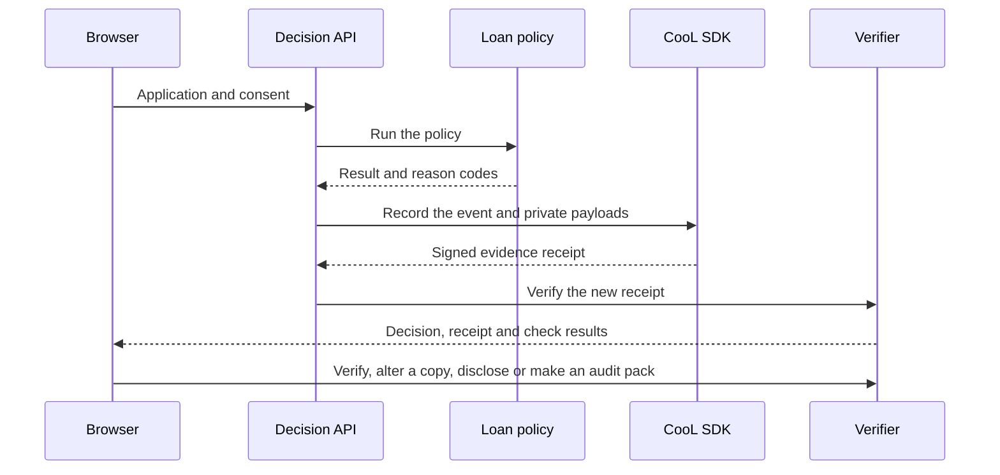

# DecisionProof

DecisionProof gives a digital lending decision a receipt that can be checked later, even outside the lender's system.

We built it for Round 2 of the Reverse Hackathon using the CooL SDK. We are **Team Alpha: Praveen H, Sahana S, and Shubha S.**

Try the working demo: [decisionproof-team-alpha.netlify.app](https://decisionproof-team-alpha.netlify.app)

## The problem we picked

Most lending apps can tell someone whether an application was approved or declined. The harder question comes weeks or months later: *Which policy ran? Which version of the software made the call? Was the record changed after the fact?*

Today, answering those questions usually means trusting the lender's own database, logs, or screenshots. That is a weak position for a borrower raising a dispute and for a compliance team preparing an audit.

DecisionProof creates evidence when the decision happens, instead of trying to rebuild the story later.

## What the demo does

The app runs a small, readable personal-loan scorecard. After the user gives consent and submits the form, the same request creates a CooL receipt for that decision.

From there, you can:

- verify the receipt from its own bytes;
- change one character in a copy and watch verification fail;
- reveal only the committed decision output;
- create more decisions, verify them together, and download the resulting audit pack as JSON.

We kept the lending rule simple on purpose. The interesting part of this project is not a mystery scoring model. It is the proof around the decision.

## Why the CooL SDK is important

A lending decision is easy to display, but much harder to prove later. A normal database row or
application log remains under the lender's control: it can be edited, deleted, or exported without
enough context to show which code and policy produced it. That means a borrower, auditor, or
compliance reviewer must trust the same organization whose decision is being examined.

CooL changes the evidence model. Instead of merely saving a result, it creates a portable,
cryptographically protected receipt at the moment of the decision.

| CooL capability | Why it matters to DecisionProof |
| --- | --- |
| Salted commitments | The application can prove that a later disclosure matches the original input or output without placing that private data in the receipt |
| Hybrid ML-DSA-65 + Ed25519 signatures | A changed receipt no longer verifies, making tampering detectable |
| Software, model, and policy identity | Reviewers can see which declared versions were associated with the decision |
| RFC 6962 transparency-log proof | The receipt proves its digest was included in an append-only Merkle tree |
| Offline verification | A reviewer can check the receipt from its own bytes instead of asking the lender's database whether it is genuine |
| TEE attestation support | A production deployment can bind the signing key to a measured confidential workload |
| Selective disclosure and audit packs | The same evidence can support a focused dispute or a batch compliance review |

This makes CooL the trust layer of the project, not just a logging dependency. DecisionProof still
owns the lending rule and user experience; CooL makes the evidence around their execution
independently checkable. It proves that the recorded artifact is internally consistent and has not
been changed. It does not prove that the lending policy itself is fair, legal, or correct.

## How DecisionProof works with CooL

The decision API calls `cool.record()` with the execution ID, event type, policy and model versions, result metadata, software identity, and the private input and output payloads.

The returned receipt contains commitments to those payloads, not their plaintext. CooL then lets the app check the hybrid signatures, record binding, and transparency-log inclusion without asking the lender's database whether the receipt is genuine.

We also use CooL's selective disclosure and audit-pack APIs. If CooL were removed, the core of DecisionProof would disappear; all that would remain is a normal loan form and an ordinary application log.

### Architecture



The architecture keeps the responsibilities separate:

1. **The browser collects consent and application data.** It sends one decision request and keeps
   the returned receipts for the current session.
2. **The DecisionProof API runs the policy.** The scorecard produces an outcome and reason codes;
   CooL does not make or judge the lending decision.
3. **The API records the event.** It passes the execution ID, policy and model versions, software
   identity, result metadata, and private payloads to `cool.record()`.
4. **CooL commits, binds, signs, and logs.** Private values become salted hashes, the complete
   record is deterministically bound, the binding is signed, and its digest is added to the
   transparency log.
5. **The receipt returns with the response.** It contains commitments and verification material,
   not the applicant's raw name, email, or full application.
6. **Verification is independent.** The verifier recomputes the binding, signature, and log proof
   from the receipt bytes. Changing even one protected value causes the relevant checks to fail.
7. **The same receipts support controlled review.** A user can disclose only the outcome or combine
   multiple receipts into a verifiable audit pack.

This demo uses CooL's explicitly labelled simulator, so the cryptographic binding, signatures, and
transparency proof are real while hardware-backed attestation is reported as `simulated`. In a
production architecture, the CooL evidence plane would run inside a Phala dstack confidential VM,
with a pinned workload measurement and a signing key derived inside the trusted execution
environment.

## Follow one decision through the app



The browser keeps the receipt artifacts created during the current session. It sends them back when the user verifies a receipt or builds an audit pack. That detail matters on Netlify because the next click may reach a fresh serverless instance.

## Project layout

| Path | What is there |
| --- | --- |
| `public/` | The interface, animations, fonts, icons, and browser-side session state |
| `netlify/functions/api.mjs` | The Netlify Function that receives every evidence request |
| `netlify.toml` | Hosting, routing, and cache settings for Netlify |
| `lib/decisionproof.mjs` | The loan rule and every CooL operation |
| `server.mjs` | A small local server using the same API code |
| `test.mjs` | One end-to-end test of the full evidence flow |
| `vendor/` | The CooL SDK v3.0.0 package built from the organizers' repository |

## Run it locally

You need Node.js 20 or newer.

```bash
npm install
npm start
```

Then open [http://127.0.0.1:4173](http://127.0.0.1:4173). The simulator does not need an API key, database, wallet, or external service.

To run the integration test:

```bash
npm test
```

The test makes a decision, verifies it, rejects an altered copy, checks a selective disclosure, and verifies an audit pack.

## A quick walkthrough

1. Submit the pre-filled application and watch the evidence path finish.
2. Open the receipt and point out the policy, model, runtime mode, and privacy check.
3. Scroll to the independent verifier. Each trust domain reports its own result.
4. Click **Alter a copy**. The binding and signature checks should fail while the original receipt stays untouched.
5. Click **Reveal outcome** to prove that the disclosed result matches its earlier commitment.
6. Make one more decision with a different credit score, build the audit pack, and download the verified JSON file.

## A few choices we made

**No hidden model.** A judge can read the scorecard in `lib/decisionproof.mjs` and see why it approved, declined, or requested review.

**No dependence on server memory.** The API returns the signed artifact to the browser. Verification, disclosure, and audit packs still work after a serverless cold start.

**No raw application in the receipt.** The name, email, and full input are committed by CooL but are not sent back as part of the receipt artifact.

**The same SDK version everywhere.** The repository includes `vendor/cool-nwc-3.0.0.tgz`, built from the supplied `Northwind-Cipher/cool-sdk` checkout. This avoids silently deploying an older registry version.

**No pretend hardware claim.** This build uses the CooL simulator. The interface reports enclave and attestation checks as simulated. A real hardware claim would require a dstack deployment and a pinned measurement.

## Limits of this prototype

This is not a lending product and the sample policy should not be used for real underwriting. Receipts last for the browser session, and there is no login, identity check, permanent database, or production key-management policy.

DecisionProof can show that the recorded evidence is internally consistent and unchanged. It cannot decide whether the lending policy itself is fair, legal, or correct.

## What we would build next

The next version would run the evidence service inside a Phala dstack confidential VM, require a known hardware measurement, and store encrypted receipts behind borrower and auditor accounts. We would also connect it to a real decision engine, add authorized field-by-field disclosure, and export signed compliance reports.

## Deploying

The live demo is hosted on Netlify. New commits to `main` are deployed automatically, and Netlify reads the publish and function settings from `netlify.toml`. You can also deploy it from the command line:

```bash
netlify deploy --prod
```

Netlify serves `public/` as the site and sends `/api` requests to `netlify/functions/api.mjs`.

## License and credits

DecisionProof is released under the [MIT License](LICENSE).

The CooL SDK comes from [Northwind Cipher](https://github.com/Northwind-Cipher/cool-sdk) and is licensed under Apache-2.0. The interface uses Lucide icons and the Space Grotesk typeface under their respective open-source licenses.
