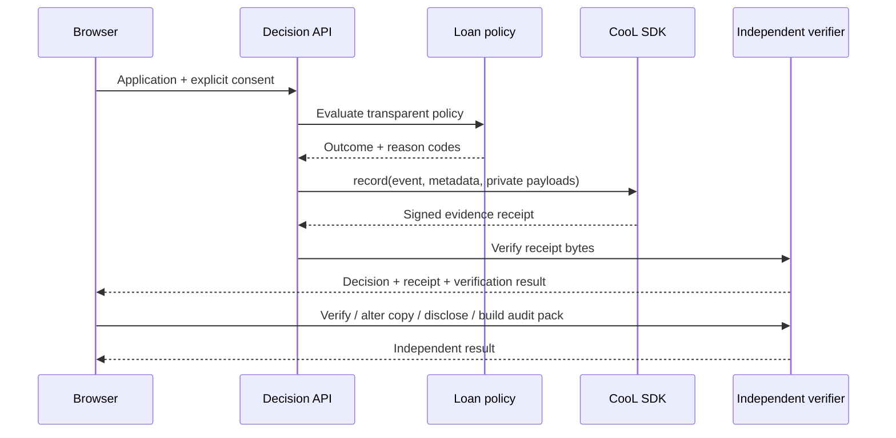

# DecisionProof

**Tamper-evident evidence for digital lending decisions.**

DecisionProof is Team Alpha's Round 2 submission for the Reverse Hackathon. It creates a cryptographically verifiable receipt at the moment a sample loan policy makes a decision, without placing the applicant's name, email, or raw application inside that receipt.

**Team Alpha:** Praveen H, Sahana S, and Shubha S

## The problem

When a digital lender approves, declines, or flags an application, the borrower and the compliance team usually receive only the result. If the decision is disputed later, they may have to trust the lender's database, screenshots, or logs to show which policy and software produced it. Those records can be incomplete, edited, or difficult for an outside reviewer to verify.

This matters now because lending decisions are increasingly automated while complaints, audits, model updates, and regulatory reviews still happen after the event. A trustworthy record has to be created when the decision happens—not reconstructed after a dispute begins.

## What we built

The prototype contains a transparent personal-loan scorecard and a complete evidence workflow:

- Run a deterministic lending policy using realistic application inputs.
- Create a CooL evidence receipt during the same request as the decision.
- Verify the receipt independently from its own bytes.
- Change one byte in a copy and see verification fail.
- Reveal only the committed decision output through selective disclosure.
- Package all receipts created in the browser session into a verified audit pack.

The scorecard is intentionally simple and visible. The product being demonstrated is the evidence layer around the decision, not a claim that this policy is suitable for real lending.

## Why CooL is essential

CooL is not an extra badge added after the decision. The decision route calls `cool.record()` with the execution ID, event type, policy version, model version, outcome metadata, software identity, and private input/output payloads.

CooL gives DecisionProof capabilities that ordinary application logs do not:

1. **Salted commitments** bind the receipt to the private input and output without storing their plaintext in the receipt.
2. **Hybrid signatures** make a later change detectable by the independent verifier.
3. **Transparency-log inclusion** proves the event is part of the signed append-only log represented by the receipt.
4. **Offline verification** lets a reviewer check the evidence without trusting the lender's database.
5. **Selective disclosure** reveals the decision output and proves that it matches the original commitment.
6. **Audit packs** verify multiple receipts together and map them to review obligations.

Without CooL, DecisionProof would be another lender-controlled activity log. With CooL, the receipt itself carries the material needed to detect alteration.

## How it works



### Architecture

| Layer | Responsibility |
| --- | --- |
| `public/` | Responsive browser interface, interaction states, and session-held receipt artifacts |
| `api/index.mjs` | Single Vercel Function entry point for every evidence operation |
| `lib/decisionproof.mjs` | Loan policy, CooL recording, verification, disclosure, tamper demonstration, and audit-pack logic |
| `server.mjs` | Small local Node server that serves the same interface and API used in production |
| `vendor/` | Reproducible CooL SDK v3.0.0 package built from the organizer repository |

Every browser request uses the same `/api` function with an `action` query. The signed receipt artifact is returned to the browser and sent back for later checks. This keeps verification functional even when a serverless instance is replaced between requests; the API does not depend on a permanent in-memory database.

## Run locally

Requirements:

- Node.js 20 or newer
- npm 10 or newer

```bash
npm install
npm start
```

Open [http://127.0.0.1:4173](http://127.0.0.1:4173).

No API keys, database, wallet, or external service are required for the simulator demo.

## Test

```bash
npm test
```

The integration test creates a decision and then exercises independent verification, tamper detection, selective disclosure, and audit-pack verification using the returned artifact rather than server memory.

## Deploy to Vercel

```bash
vercel --prod
```

The root `vercel.json` configures the Node.js function duration and immutable caching for bundled fonts and icons. Vercel serves `public/` as static assets and `api/index.mjs` as the evidence API.

## Demo script

1. Submit the pre-filled application and watch the evidence lifecycle complete.
2. Point out the policy, model, runtime mode, and privacy check in the receipt.
3. Open the independent verifier and explain the seven separate trust domains.
4. Choose **Alter a copy**. Only the copy changes; the original remains untouched. Binding and signature checks fail.
5. Choose **Reveal outcome** to show selective disclosure of the committed output.
6. Create another decision with a different credit score and build the session audit pack.

## Important technical decisions

- **A deterministic scorecard instead of a black-box model:** judges can see exactly what caused each outcome, keeping the evidence integration—not model complexity—as the focus.
- **Receipt artifacts travel with the browser:** serverless cold starts do not break verification, disclosure, or audit-pack creation.
- **Private input is never returned as an artifact:** the full application is committed by CooL but is not included in the receipt sent back to the interface.
- **The organizer's SDK is pinned:** `vendor/cool-nwc-3.0.0.tgz` was produced from the supplied `Northwind-Cipher/cool-sdk` repository so the build uses the exact Round 2 API rather than an older registry release.
- **No fake hardware claim:** the current deployment uses CooL's simulator and labels enclave/attestation results as simulated.

## Privacy and security boundary

The receipt does not contain the applicant's name, email, or plaintext input/output payloads. The browser receives the receipt plus the decision output required for the selective-disclosure demonstration. Production lending software would keep disclosure values under the lender's access controls and release them only after authorization.

DecisionProof proves that the recorded bytes, signatures, commitments, and log inclusion are internally consistent. It does **not** prove that the lending policy is fair, lawful, accurate, or appropriate. Those remain separate governance responsibilities.

## Current limitations

- The lending policy and applicant data are demonstrations, not real underwriting.
- The simulator provides cryptographic evidence but not hardware-backed enclave attestation.
- Browser-held receipts last only for the current page session.
- There is no borrower identity verification, lender authentication, durable database, or production key-management policy.
- External witnesses and a public-chain anchor are not configured.

## Future improvements

- Run the evidence service inside a Phala dstack confidential VM and require verified hardware measurements.
- Add authenticated borrower and auditor portals with durable, encrypted receipt storage.
- Import real policy and model-release identifiers from a lender's decision engine.
- Add authorized selective disclosure for specific fields and consent records.
- Export signed audit packs and machine-readable compliance reports.
- Add witness gossip and public anchoring for stronger split-view resistance.

## License and attribution

DecisionProof is available under the [MIT License](LICENSE).

The bundled CooL SDK package is from [Northwind Cipher's CooL SDK repository](https://github.com/Northwind-Cipher/cool-sdk) and remains licensed under Apache-2.0. Lucide icons are used under the Lucide license, and Space Grotesk is used under the SIL Open Font License.
